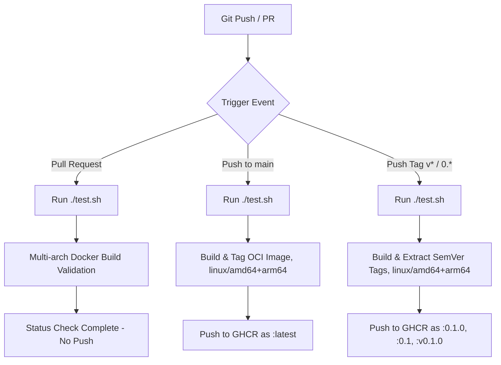

# Release Process & CI/CD Documentation

This document describes how Continuous Integration (CI) and Continuous
Delivery (CD) are configured for `vault-aws-credential-helper`, and provides
instructions for publishing new releases to GitHub Container Registry (GHCR).

---

## CI/CD Pipeline Overview

The project uses GitHub Actions ([.github/workflows/ci.yml](.github/workflows/ci.yml))
to automate testing, building, and publishing OCI container images.



### Workflow Behavior

1. **Pull Requests (`pull_request`)**:
   - Runs the test suite (`./test.sh`) — unit tests via a containerized Go
     toolchain, a native-platform image build, and container smoke tests.
   - Validates that the multi-stage [Dockerfile](Dockerfile) builds cleanly
     for both `linux/amd64` and `linux/arm64`.
   - **Does NOT push** images to GHCR to avoid polluting the registry with
     untested PR artifacts.

2. **Main Branch Commits (`push: branches: [main]`)**:
   - Executes the test suite (`./test.sh`).
   - Builds the minimal, scratch-based OCI image from [Dockerfile](Dockerfile)
     for both `linux/amd64` and `linux/arm64` (the Go builder stage
     cross-compiles natively for both — no qemu emulation involved).
   - Authenticates to `ghcr.io` using the automatic `${{ secrets.GITHUB_TOKEN }}`.
   - Pushes a multi-arch image tagged as `ghcr.io/uivraeus/vault-aws-credential-helper:latest`.

3. **Version Tags (`push: tags: ['v*', '[0-9]*']`)**:
   - Executes the test suite (`./test.sh`).
   - Builds the multi-arch image and applies Semantic Versioning tags
     automatically via `docker/metadata-action`:
     - `ghcr.io/uivraeus/vault-aws-credential-helper:0.1.0` (exact SemVer)
     - `ghcr.io/uivraeus/vault-aws-credential-helper:0.1` (major/minor alias)
     - `ghcr.io/uivraeus/vault-aws-credential-helper:v0.1.0` (raw tag name)

---

## How to Create & Publish a Release

To publish a new versioned release (e.g., `0.1.0`):

### Option 1: Using Git CLI (Recommended)

1. Ensure your local `main` branch is up to date:
   ```bash
   git checkout main
   git pull origin main
   ```

2. Create an annotated SemVer tag:
   ```bash
   git tag -a v0.1.0 -m "Release version 0.1.0"
   ```

3. Push the tag to GitHub:
   ```bash
   git push origin v0.1.0
   ```

4. The GitHub Actions workflow will trigger automatically, run tests, build
   the multi-arch image, and publish `ghcr.io/uivraeus/vault-aws-credential-helper:0.1.0`.

### Option 2: Using GitHub Web UI

1. Go to the repository on GitHub: `https://github.com/uivraeus/vault-aws-credential-helper`.
2. Navigate to **Releases** → **Draft a new release**.
3. Set the tag version (e.g. `v0.1.0`), choose `main` as the target, write
   release notes, and click **Publish release**.

---

## Verification

Once published, verify that the image can be pulled and run directly from
GHCR (either architecture resolves automatically):

```bash
docker run --rm ghcr.io/uivraeus/vault-aws-credential-helper:0.1.0 credential_process
```

With no `VAULT_*` env vars set, this should fail fast with a `missing
required configuration` error on stderr and exit code `2` — confirming the
image runs and its config validation works, without needing a real Vault. To
inspect the published manifest's platforms without pulling:

```bash
docker buildx imagetools inspect ghcr.io/uivraeus/vault-aws-credential-helper:0.1.0
```
